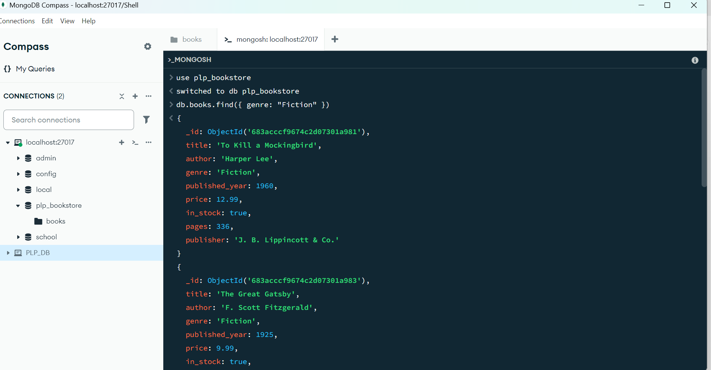

# 📘 MongoDB Bookstore Queries

This project provides MongoDB scripts for inserting books, querying data, performing aggregation, and optimizing performance with indexing.

## 🛠 Prerequisites

Ensure you have the following installed before running the scripts:

- **[Node.js](https://nodejs.org/)** (Check with `node -v`)
- **[MongoDB](https://www.mongodb.com/)** (Ensure MongoDB is running with `mongod`)
- **VS Code** (Recommended for script execution)

## 🚀 How to Run the Project

### **1️⃣ Start MongoDB**
Ensure MongoDB is running before executing scripts. Open a terminal and start MongoDB:

```sh
mongod

# 2️⃣ Clone or Copy the Project
# If using Git, run:
git clone <your-repo-url>
cd mongodb-bookstore

# 3️⃣ Install Dependencies
Navigate to the project folder and install required dependencies:

sh
npm install mongodb
4️⃣ Insert Sample Books into MongoDB
Run the insert_books.js script to populate the database with sample books:

sh
node insert_books.js

# 5️⃣ Execute Queries
Run the queries.js script to execute predefined queries:

sh
node queries.js

# Alternatively, you can run individual queries from the mongodb_queries.txt file.
# 6️⃣ Run Queries Manually in MongoDB Shell (Optional)
# If you prefer to test queries manually, follow these steps:

Open MongoDB shell:

sh
mongosh
Switch to the database:

sh
use plp_bookstore
Copy queries from mongodb_queries.txt and paste them into the MongoDB shell.

# 📂 Project Structure
mongodb-bookstore/
│── insert_books.js      # Script to populate MongoDB with sample book data
│── queries.js           # Executes predefined MongoDB queries
│── queries.txt  # Contains raw queries for manual execution
│── README.md            # Instructions on setup & usage
📌 Notes
# Ensure MongoDB is running before executing queries.

# Modify connection settings if using MongoDB Atlas instead of a local instance.

Use the explain("executionStats") method to analyze index performance.

## MongoDB Database Preview

